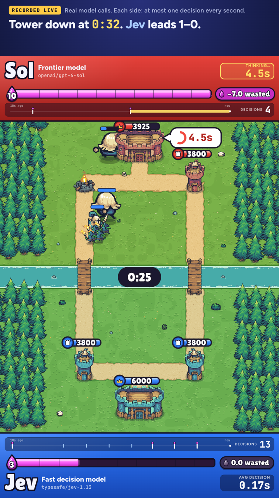

# System One Arena

**Sol vs Jev** in a Clash Royale–style tower battle. Every move is a real model call through OpenRouter, and the match clock keeps running while a model thinks, so a slow model plays on a board that has already moved.

<p align="center"></p>

- **Jev**: TypeSafe's "System One" decision model (`typesafe/jev-1.13`), through OpenRouter's Decisions endpoint.
- **Sol**: a frontier model (`openai/gpt-6-sol`), through chat completions with a strict JSON schema.

## Results

Every move was a live call, and every match is archived in full in [`matches/`](matches/README.md). Both sides got the same brief and options, at most one decision per second.

| Opponent | Result | Avg decision, Jev vs opponent | Cost per decision, Jev vs opponent |
| --- | --- | --- | --- |
| Sol (`openai/gpt-6-sol`) | Jev won 3–0, king tower at 28.7s | 0.20s vs 4.0s | $0.000065 vs $0.0039 (61×) |
| Luna (`openai/gpt-6-luna`), 3 matches | Jev won all three | 0.17–0.18s vs 4.2–5.5s | about $0.000067 vs $0.0002 (3×) |

## How it works

The game engine (`arena/engine/sim.py`) runs on the server and is deterministic. When a side needs to decide, the runner calls its model without pausing the clock, and the move lands whenever the answer comes back. The browser only draws the frames the server streams. `arena/engine/game.py` turns the board into what the models see: units described by class and stats rather than by name, and positions in words.

## Run it

```sh
uv sync
cp .env.example .env              # add OPENROUTER_API_KEY, or set OPENROUTER_MOCK=true to play without a key
uv run python -m arena            # http://localhost:8000, press Start match
```

Watch or re-simulate the recorded matches without a key or a model call:

```sh
uv run python -m arena                              # then open http://localhost:8000/?replay=<id>
uv run python tools/rerun.py <id>                   # replays the logged answers and checks the result matches
uv run --group tools python tools/record.py <id>    # 1080x1920 MP4
```

`http://localhost:8000/?demo` runs a labelled browser-only simulation. `.env.example` lists every setting, including a cheap Jev vs Jev setup and a per-match call cap. Run the tests with `uv run pytest`; they need no network.

## Credits

Art: [Tiny Swords](https://pixelfrog-assets.itch.io/tiny-swords) by Pixel Frog (CC0). Inspired by Clash Royale; not affiliated with or endorsed by Supercell. Clash Royale is a trademark of Supercell Oy.

## License

MIT, see [`LICENSE`](LICENSE). The Tiny Swords art in `web/tinyswords/` is CC0 (see its `LICENSE.txt`).
